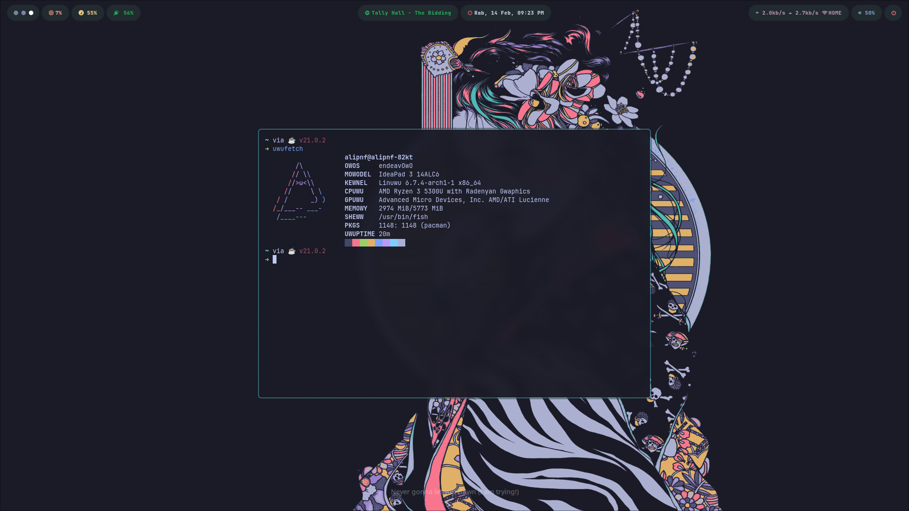

  

# dotfiles

- Window Manager
  - [Hyprland](https://hyprland.org/)
- Status bar
  - [Waybar](https://archlinux.org/packages/extra/x86_64/waybar/)
- Compositor
  - [Wlroots](https://gitlab.freedesktop.org/wlroots/wlroots/)
- Lock screen
  - [Swaylock](https://github.com/jirutka/swaylock-effects)
- Screenshot
  - [Hyprshot](https://archlinux.org/packages/extra/x86_64/xclip/)
  - Shortcut:
  <pre>
      PrtScrn = Full Screen
      Mod + PrtScrn = Window
      Mod + Shift + PrtScrn = Selection
      //clipboard only
      Ctrl + PrtScrn = Clipboard Full Screen
      Ctrl + Mod + PrtScrn = Clipboard Window
      Ctrl + Mod + Shift + PrtScrn = Clipboard Selection
- Shell
  - [Fish shell](https://fishshell.com/)
  - [Fisher](https://github.com/jorgebucaran/fisher) - Plugin manager
  - [Oh my fish](https://github.com/oh-my-fish/oh-my-fish) - The Fishshell Framework
  - [z for fish](https://github.com/jethrokuan/z) - Directory jumping
  - [Gogh](https://gogh-co.github.io/Gogh/) - Color Scheme (Breath Silverfox)
  - [Lazygit](https://github.com/jesseduffield/lazygit) - Terminal-Based Git GUI
  - [Tmux](https://github.com/tmux/tmux) - Terminal Multiplexer
  - [Starship](https://starship.rs/) - Cross Shell Prompt
- Text Editor
  - [VSCodium](https://vscodium.com/)
  - [Neovim](https://neovim.io/) - ([Lazyvim](https://www.lazyvim.org/))
    custom plugin: <pre>
    [wakatime/vim-wakatime](https://github.com/wakatime/vim-wakatime) - Plugin wakatime.
    [barrett-ruth/live-server.nvim](https://github.com/barrett-ruth/live-server.nvim) - Live server for vim
    [iamcco/markdown-preview.nvim](https://github.com/iamcco/markdown-preview.nvim) - Markdown live preview
    [christoomey/vim-system-copy](https://github.com/christoomey/vim-system-copy) - Copying text from Vim to clipboard
    [max397574/better-escape.nvim](https://github.com/max397574/better-escape.nvim) - Escape from insert mode without delay
    [smjonas/inc-rename.nvim](https://github.com/smjonas/inc-rename.nvim) - Incremental LSP renaming
    [mattn/emmet-vim](https://github.com/mattn/emmet-vim) -Emmet for vim
