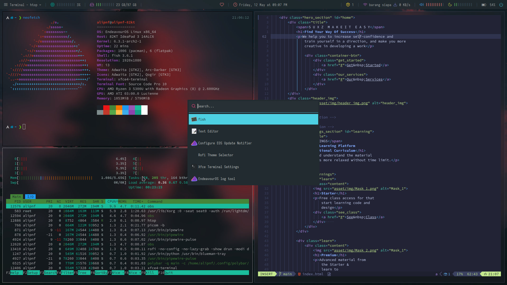

  

# dotfiles
- Window Manager 
    - [i3](https://i3wm.org/)
- Status bar
    - [Polybar](https://github.com/polybar/polybar)
- Shell 
    - [Fish shell](https://fishshell.com/)
    - [Fisher](https://github.com/jorgebucaran/fisher) - Plugin manager
    - [Tide](https://github.com/IlanCosman/tide) - Shell theme
    - [Nerd fonts](https://github.com/ryanoasis/nerd-fonts) - (Hack) 
    - [z for fish](https://github.com/jethrokuan/z) - Directory jumping
    - [Gogh](https://gogh-co.github.io/Gogh/) - Color Scheme (Breath Silverfox)
    - alias: <pre>g = git
    gf= git fetch
    gp= git pull
    ga= git add
    gst= git status
    gci= git commit
    gcim= git commit -am
    gco= git checkout
    gbr= git branch
    gps= git push
    code= codium
    ll= exa --long --header -a
- Text Editor
    - [VSCodium](https://vscodium.com/)
    - [Neovim](https://neovim.io/) - ([Lazyvim](https://www.lazyvim.org/))
